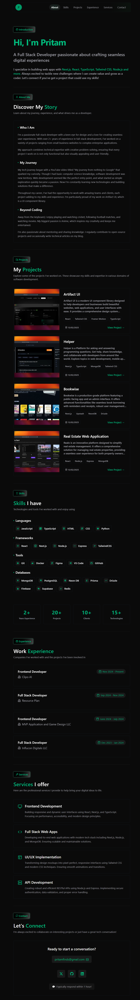

# Portfolio Template



## Overview

A modern, responsive portfolio template built with Next.js, TypeScript, and Tailwind CSS. This template is designed to showcase your skills, projects, and professional experience with a clean and elegant UI.

## Features

- **Modern UI Design**: Clean, minimal interface with smooth animations and transitions
- **Responsive Layout**: Looks great on all devices from mobile to desktop
- **Dark/Light Mode**: Built-in theme switching capability
- **Section-Based Structure**: Organized sections for introduction, about, projects, skills, experience, services, and contact
- **Custom Icons**: Unique icons for each section using Lucide React
- **Interactive Components**: Spotlight cards, project showcases, and more
- **SEO Optimized**: Ready for search engine visibility
- **Fast Performance**: Built on Next.js for optimal loading speeds

## Tech Stack

- **Framework**: Next.js 15 (App Router)
- **Language**: TypeScript
- **Styling**: Tailwind CSS v4
- **Icons**: Lucide React, React Icons
- **Animations**: CSS Animations, Framer Motion
- **Deployment**: Vercel

## Getting Started

### Prerequisites

- Node.js 18.0 or later
- npm, yarn, or pnpm

### Installation

1. Clone the repository

   ```bash
   git clone https://github.com/yourusername/artifact-portfolio-template.git
   cd artifact-portfolio-template
   ```

2. Install dependencies

   ```bash
   npm install
   # or
   yarn install
   # or
   pnpm install
   ```

3. Start the development server

   ```bash
   npm run dev
   # or
   yarn dev
   # or
   pnpm dev
   ```

4. Open [http://localhost:3000](http://localhost:3000) in your browser

## Customization

### Personal Information

Update your personal information in the section components located in `components/sections/`:

- `Intro-section.tsx`: Update your name and introduction
- `about-section.tsx`: Modify your bio and personal story
- `experience-section.tsx`: Add your work experience
- `projects-section.tsx`: Showcase your projects
- `skills-section.tsx`: List your technical skills
- `services-section.tsx`: Describe services you offer
- `contact-section.tsx`: Update your contact information and social links

### Styling

The project uses Tailwind CSS for styling. You can customize the theme in `globals.css`.

## Deployment

The easiest way to deploy your portfolio is using [Vercel](https://vercel.com):

1. Push your code to a GitHub repository
2. Import the project to Vercel
3. Deploy with a single click

## License

This project is licensed under the MIT License - see the LICENSE file for details.

## Acknowledgements

- [Next.js](https://nextjs.org)
- [Tailwind CSS](https://tailwindcss.com)
- [Lucide Icons](https://lucide.dev)
- [React Icons](https://react-icons.github.io/react-icons)

---

Built with ❤️ by Pritam.
